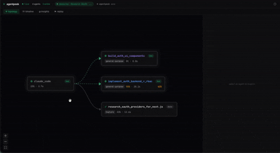

<div align="center">
  <h1>AgentPeek</h1>
  <p>Real-time observability for Claude Code agent teams.</p>

  <a href="https://github.com/TranHuuHoang/agentpeek/blob/main/LICENSE"></a>
  <a href="https://www.python.org/"></a>
</div>

<br>

You can't improve what you can't see. When Claude Code spawns 10 agents to refactor your codebase, you're blind — you don't know which agent spawned which, what's running in parallel, why something failed, or where your tokens went. AgentPeek makes all of that visible in real-time.

## What you get

- **Agent orchestration** — who spawned who, what's parallel vs sequential, the full team hierarchy as a live directed graph
- **Execution traces** — every tool call with full inputs/outputs, retries, failures, and timing
- **Prompts & results** — the exact prompt each agent received and what it returned
- **Cost attribution** — per-agent token estimates so you know which agent is burning your budget
- **Stuck detection** — real-time alerts when an agent is looping on the same failed call
- **Files touched** — which agents read, wrote, edited, or deleted which files
- **Session replay** — full chronological event log for post-session debugging
- **Cross-session baselines** — track agent performance over time in plain English
- **Bottleneck analysis** — identify the slowest agent, wasted work, and parallelism gaps

<p align="center">
  
</p>

## Quick start

### Prerequisites

| Tool | macOS | Linux | Windows |
|------|-------|-------|---------|
| Python 3.10+ | `brew install python` | `sudo apt install python3` | [python.org](https://www.python.org/downloads/) |
| pipx | `brew install pipx` | `sudo apt install pipx` | `pip install pipx` |
| jq | `brew install jq` | `sudo apt install jq` | [jq releases](https://jqlang.github.io/jq/download/) |
| Claude Code | [docs.anthropic.com](https://docs.anthropic.com/en/docs/claude-code) | ← same | ← same |

### Install

```bash
git clone https://github.com/TranHuuHoang/agentpeek.git
cd agentpeek
pipx install -e .
agentpeek
```

That's it. Hooks are auto-installed into `~/.claude/settings.json`. The dashboard opens at `http://localhost:8099`. Start Claude Code in another terminal — agents appear in real-time.

## Documentation

Full documentation is in this README. For architecture details, see [How it works](#how-it-works).

## CLI

```bash
agentpeek                  # Start server + install hooks + open browser
agentpeek --no-browser     # Start without opening browser
agentpeek --port 9000      # Custom port
agentpeek --install-hooks  # Just install hooks and exit
agentpeek --uninstall      # Remove hooks from settings.json
```

## Dashboard

### Topology
Left-to-right directed graph showing agent orchestration. Each node displays name, type, estimated cost, duration, and errors. Arrows show spawn direction. Stuck agents get amber borders.

### Timeline
Gantt chart of agent execution. Parallel agents overlap, sequential agents are staggered. Hierarchy shown via indentation. Auto-scales from seconds to hours.

### Insights
Prioritized operational intelligence:

1. **"Is my agent stuck?"** — amber alerts when loop detection fires (repeated tool calls or consecutive failures)
2. **"Where did my tokens go?"** — stacked cost bar with per-agent breakdown, estimated via Sonnet 4 pricing
3. **"What should I do?"** — bottleneck identification, error recovery analysis, parallelism opportunities
4. **Agent Performance** — table with duration, token share, estimated cost, errors
5. **Agent Type Profiles** — cross-session baselines in plain English ("Usually makes 3–5 tool calls, takes 2–4s")

### Replay
Chronological event stream with full tool I/O. Color-coded by type (spawn/call/result/error). Click to expand. Filter by agent or tool.

### Detail panel
Click any agent to inspect: performance cards, execution trace with retry badges, files touched, the prompt it received, and its final output.

## Session management

Session tabs are auto-named from agent descriptions. Dismiss tabs with hover-X, restore from the history popover (clock icon, top-right).

## How it works

AgentPeek installs async hooks into `~/.claude/settings.json`. When Claude Code runs tools or spawns agents, hooks append JSON events to `/tmp/agentpeek.jsonl` via `jq`. The server tails this file, builds state, and serves the dashboard. All hooks are non-blocking.

```
Claude Code hooks → jq → /tmp/agentpeek.jsonl
                              ↓
                      AgentPeek server (tail file)
                              ↓
              ┌───────────────┼───────────────┐
              │                               │
       In-memory state                  SQLite persistence
       (live topology)                  (~/.agentpeek/history.db)
              │                               │
              └───────→ Scorer ←──────────────┘
                            ↓
                     Dashboard at :8099
```

## Development

```bash
pipx install -e .                       # Backend
cd frontend && npm install && npm run dev  # Frontend (hot reload, proxies to :8099)
cd frontend && npm run build             # Build for production
```

## Tech stack

**Backend:** Python — Starlette, uvicorn, aiosqlite, Pydantic, Click
**Frontend:** React, TypeScript, Tailwind CSS v4, React Flow, dagre
**Persistence:** SQLite (WAL mode) · **Communication:** SSE with polling fallback

## License

MIT
